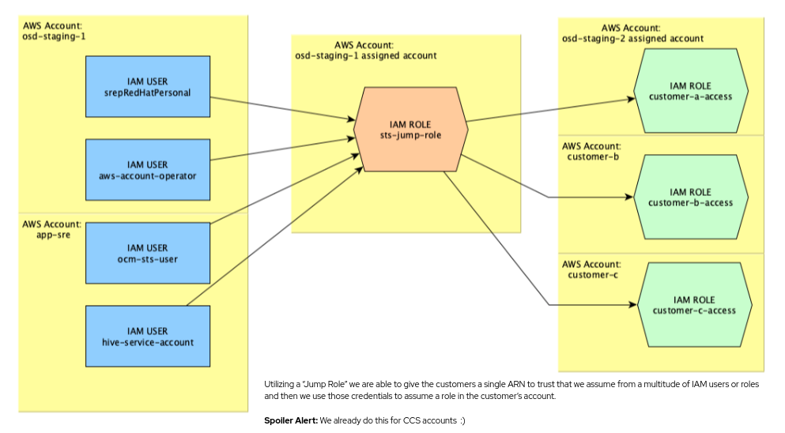

## 1.1 - Prerequisites

Please ensure you have the following installed, or configured, on your machine before continuing:

* [Golang](https://golang.org/doc/install)
* [aws-cli](https://aws.amazon.com/cli/)
* Typically you'll want to use [CRC](https://github.com/code-ready/crc/) for local development, though it's fine if you're running OpenShift another way.
* You need to have [the operator-sdk binary](https://github.com/operator-framework/operator-sdk/releases) in your `$PATH` < v0.18.

### 1.1.1 - IAM User and Secret

The operator requires a secret named `aws-account-operator-credentials` in the `aws-account-operator` namespace, containing credentials to the AWS `Payer Account` you wish to create accounts in. The `Payer Account` is the root account in an organization and can create linked accounts and manage them.

The secret should contain credentials for an IAM user in the `Payer Account` with the data fields `aws_access_key_id` and `aws_secret_access_key`.

The user should have the following IAM permissions:

Permissions to allow the user to assume the `OrganizationAccountAccessRole` role in any account created:

```json
{
   "Version": "2012-10-17",
   "Statement": {
       "Effect": "Allow",
       "Action": "sts:AssumeRole",
       "Resource": "arn:aws:iam::*:role/OrganizationAccountAccessRole"
   }
}

```

Permissions to allow the user to interact with the support center:

```json
{
    "Version": "2012-10-17",
    "Statement": [
        {
            "Effect": "Allow",
            "Action": [
                "support:*"
            ],
            "Resource": "*"
        }
    ]
}

```

Once the user has been configured, you can deploy the secret by exporting the access key and secret to the env variables listed below, and then, running `make deploy-aws-account-operator-credentials`:

```
OPERATOR_ACCESS_KEY_ID
OPERATOR_SECRET_ACCESS_KEY
```

Alternatively, if you have the credentials stored in your `~/.aws/credentials` file, you can use the script in `hack/scripts/set_operator_credentials.sh` to create the secret from that profile:

    .hack/scripts/set_operator_credentials.sh my-aws-profile

**Note** the aws credentials file should be in the following format:
```
[osd-staging-1]
aws_access_key_id = myaccesskeyid
aws_secret_access_key = mysecretaccesskey
``` 

### 1.1.2 AWS Accounts

**Note to Red Hat employees:** As you're working on the operator you should have two accounts dedicated for your use of this operator, under each of the osd-staging `Payer Account`s.  Work with your manager or functional team lead to figure out what these account numbers are and save them, you'll need them later.

Once you have the two accounts assigned to you, you can access their consoles via [osdctl](https://github.com/openshift/osdctl/#aws-account-console-url-generate):
```
osdctl account console -p $AWSPROFILE -i $ACCOUNT_ID
```

### 1.1.3 STS Roles

To run the operator tests for [STS](0.1-Glossary.md#sts) mode you will need to create two roles &mdash; one in each of the AWS accounts you have been assigned. The name of these roles doesn't matter when you create it, however you will need to know the ARN of both in order to configure the operator to use them. By the end of these steps your two AWS accounts will look as follows:

- **Account 1 (Jump Host)**
  - This Account will be your Jump Host
  - It will have a newly created `Policy` to `Assume Role`
  - It will have a newly created `Role` for its `Jump Role`
    - The new `Policy` created, `Assume Role`, will be attached to this role
    - The `Trust Relationship` for this role will be updated to trust the `Payer Account`
- **Account 2 (Target)**
  - This Account is the one we will gain access to via the `Access Role`
  - It will have a new role
    - The Trust Relationship for this role will be updated to trust Account 1 Jump Role ARN

The following diagram shows the Account relationship



#### 1.1.3.1 - Jump Role

The `Jump Role` will be a simulation of the role that we use as a bastion of sorts. For the STS Architecture, we have an IAM user that assumes a specific role in a specific account, and then using that role they can assume role into the cluster's account in order to run operations as necessary.

You will need to create this `Jump Role` in the first osd-staging AWS account assigned to you. You will need to add your `Payer Account` IAM user credentials as the Principal in the `Trust Relationship`. Ensure this is the same user used to create the AWS Account Operator credentials.

The `Jump Role` should only require the permissions to assume-roles.  No other permissions should be necessary. You will probably need to create the IAM policy first before the Role. To do so go to your `AWS console > IAM > Policies > Create Policy > JSON`

Example Assume Role Policy:
```
{
    "Version": "2012-10-17",
    "Statement": [
        {
            "Effect": "Allow",
            "Action": "sts:AssumeRole",
            "Resource": "*"
        }
    ]
}
```

Next Step is to create the `Role` itself. To do so, go to `Roles > Create Role > Another AWS Account` - here you can paste the `Payer Account` ID for the required Account ID. Click `Next: Permissions` and select the newly created `Policy` from the previous step. Name the `Role` whatever you prefer. 

Next required step is to update the `Trust Relationship` for the `Role`. To do so, click into the `Role` you created, select the `Trust Relationship` tab and edit it, with the following example as a reference:
```
{
    "Version": "2012-10-17",
    "Statement": [
      {
          "Effect": "Allow",
          "Principal": {
              "AWS": "arn:aws:iam::[payer-account-id]:user/[your-username]"
          },
          "Action": "sts:AssumeRole",
          "Condition": {}
      }
    ]
}
```
You will need to note the `ARN` for this `Jump Role` as it's required for the next step, setting up the `Access Role`.

**Note:** You will need to put the ARN for this `Jump Role` into the Operator Config Map created later - in the `STS_JUMP_ARN` environment variable.

#### 1.1.3.2 - Access Role

The `Access Role` will be a simulation of a role on a customer's account that gives us access to initialize the regions and initialize a cluster.  On external customer accounts this is assumed to be a very locked-down role with ONLY the necessary permissions needed to run the operator or install the cluster resources. Minimal permissions required for the role are provided below.

Create a new `Role` for this account, similarly to how the role was created for the `Jump Role`, but instead of pointing to the `Payer Account` ID, point at the Account ID belonging to `Account 1`, ie. the Account with the Jump Role. 

Once created, the `Role`'s `Trust Relationship` will need to be updated with the following example:
```
{
  "Version": "2012-10-17",
  "Statement": [
    {
      "Effect": "Allow",
      "Principal": {
        "AWS": "arn:aws:iam::[jump-role-account-id]:role/[jump-role-name]"
      },
      "Action": "sts:AssumeRole",
      "Condition": {}
    }
  ]
}
```

Example minimal permissions Policy Document
```
{
  "Version": "2012-10-17",
  "Statement": [
    {
      "Effect": "Allow",
      "Action": [
        "ec2:RunInstances",
        "ec2:TerminateInstances",
        "ec2:DescribeInstanceStatus",
        "ec2:CreateTags",
        "ec2:DeleteTags"
      ],
      "Resource": "*"
    }
  ]
}
```
**Note:** You will need to put the ARN for this `Access Role` into your environment variable, `STS_ROLE_ARN`, in order for this to be used to create accountclaims within the make tests.

### 1.1.4 Config Map

The operator needs a ConfigMap that has the following fields configured:

* `account-limit`: The soft limit of AWS accounts which is the number compared against when creating new accounts
* `base`: Base [OU](https://docs.aws.amazon.com/organizations/latest/userguide/orgs_manage_ous.html) ID to place accounts in when claimed
* `root`: Root [OU](https://docs.aws.amazon.com/organizations/latest/userguide/orgs_manage_ous.html) ID to create new OUs under
* `sts-jump-role`: The arn for the jump role created [above](#1131---jump-role)


```json
{
    "apiVersion": "v1",
    "data": {
        "account-limit": "4801",
        "base": "ou-0wd6-tmsbvahq",
        "root": "r-0wd6",
        "sts-jump-role": "[arn from the jump role created above]"
    },
    "kind": "ConfigMap",
    "metadata": {
        "name": "aws-account-operator-configmap",
        "namespace": "aws-account-operator",
    }
}
```
The ConfigMap could be generated and deployed with the `hack/scripts/set_operator_configmap.sh` script.

    .hack/scripts/set_operator_configmap.sh -a ${ACCOUNT_LIMIT} -v ${VCPU_QUOTA} -r "${OSD_STAGING_1_OU_ROOT_ID}" -o "${OSD_STAGING_1_OU_BASE_ID}"

Now that those steps have been completed you can return to the Installation [Workflow Section](1.0-Installation.md#12-Workflow).