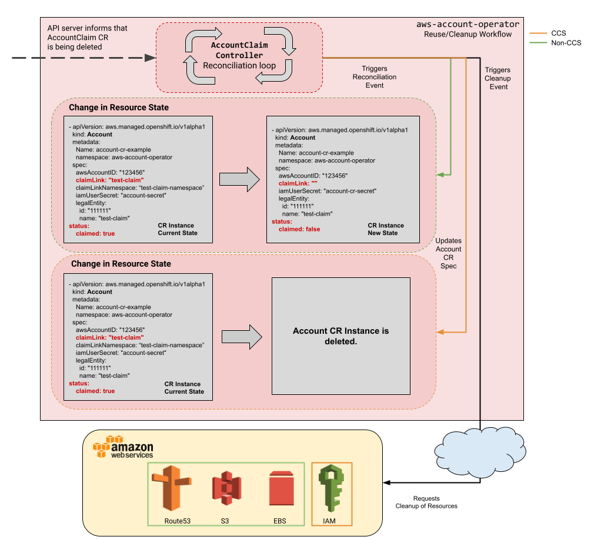

## 2.3 AccountClaim

### 2.3.1 AccountClaim CR

The `AccountClaim` CR links to an available `Account` and stores the name of the associated secret with AWS credentials for that account.

```yaml
apiVersion: aws.managed.openshift.io/v1alpha1
kind: AccountClaim
metadata:
  name: example-link
  namespace: {NameSpace cluster is being built in}
spec:
  accountLink: osd-{accountName} (From AccountClaim)
  aws:
    regions:
    - name: us-east-1
  awsCredentialSecret:
    name: aws
    namespace: {NameSpace cluster is being built in}
  legalEntity:
    id: 00000000000000
    name: {Legal Entity Name}
```

### 2.3.2 AccountClaim Controller

The `AccountClaim` controller is triggered when an `AccountClaim` CR is created in any namespace. It is responsible for the following behaviors:

1. Sets account `spec.ClaimLink` to the name of the `AccountClaim`
2. Sets `AccountClaim` `spec.AccountLink` to the name of an unclaimed Account
3. Creates a secret in the `AccountClaim` namespace that contains the credentials tied to the aws account in the `Account` CR
4. Sets `AccountClaim` `status.State = "Ready"`
5. Delinks `AccountClaim ` from  and`Account` to enable the Account to be reused (non-CCS cases)
6. Cleans up the AWS resources when an `AccountClaim` is delinked

#### Reuse/Cleanup Workflow

An `Account` can come either from the reused pool (it's going to be there for a long time, that's why you see old AGE) or be a new account that is part of the `AccountPool`.
The first time we assign an account to this `AccountClaim`, we copy the `legalEntity` from the `AccountClaim` CR to the `Account` CR.
From now on, this `Account` is marked with that specific `legalEntity` id, and it does not go away when we delete the cluster.

It will go away only when we do a cleanup of accounts. So, the reuse workflow reuses accounts from the same legalEntity id.
We do not want an external customer to use an account, delete it, and then this account gets assigned to another cluster for another customer.
Consequently, for security reasons, we reuse accounts only from the same legal entity id.

The following diagram illustrates how the `AccountClaim` controller does the reuse and cleanup of resources.



As you can see in the diagram, depending on the environment (CCS/Non-CCS) it performs differently. Red Hat OpenShift Dedicated (OSD) provides a [Customer Cloud Subscription (CCS)](https://www.openshift.com/dedicated/ccs) model that allows Red Hat to deploy and manage OpenShift Dedicated into a customer's AWS account. Reuse does not apply to CCS environments since we cannot reuse the `Account`s of the customers. It's their environment, and they own the payer account.
However, in non-CCS environments that Red Hat manages, the `Account`s can be reused.

When an `AccountClaim` CR is being deleted, the `AccountClaim` CR either deletes the `Account` CR in a CCS environment or delinks the `AccountClaim` and lets the `Account` CR be reused in a non-CCS environment.

During reconciliation, after an `AccountClaim` CR is deleted, the controller also cleans up the resources in Amazon Web Services.
In the case of CCS environments, it deletes the IAM resources, while in non-CCS environments, it cleans up resources such as EBS Snapshots, S3 Buckets, and Route53 entries.

#### Constants and Globals

```go
AccountClaimed          = "AccountClaimed"
AccountUnclaimed        = "AccountUnclaimed"
awsCredsUserName        = "aws_user_name"
awsCredsAccessKeyID     = "aws_access_key_id"
awsCredsSecretAccessKey = "aws_secret_access_key"
```

#### Spec

Updates the `AccountClaim CR`:

```yaml
spec:
  accountLink: osd-{accountName}
  aws:
    regions:
    - name: us-east-1
  awsCredentialSecret:
    name: aws
    namespace: {NameSpace}
  legalEntity:
    id: 00000000000000
    name: {Legal Entity Name}
```

* `awsCredentialSecret` holds the name and namespace of the secret with the credentials created for the `AccountClaim`.

#### Status

Updates the `AccountClaim` CR

```yaml
status:
  conditions:
    - lastProbeTime: 2019-07-16T13:52:02Z
      lastTransitionTime: 2019-07-16T13:52:02Z
    message: Attempting to claim account
    reason: AccountClaimed
    status: "True"
    type: Unclaimed
    - lastProbeTime: 2019-07-16T13:52:03Z
      lastTransitionTime: 2019-07-16T13:52:03Z
    message: Account claimed by osd-creds-mgmt-fhq2d2
    reason: AccountClaimed
    status: "True"
    type: Claimed
    state: Ready
```

* `state` can be any of the ClaimStatus strings defined in [accountclaim_types.go](https://github.com/openshift/aws-account-operator/blob/master/pkg/apis/aws/v1alpha1/accountclaim_types.go#L84)
* `conditions` indicates the last state the account had and supporting details

#### Metrics

Updated in the `AccountClaim` controller:

```txt
MetricTotalAccountClaimCRs
```