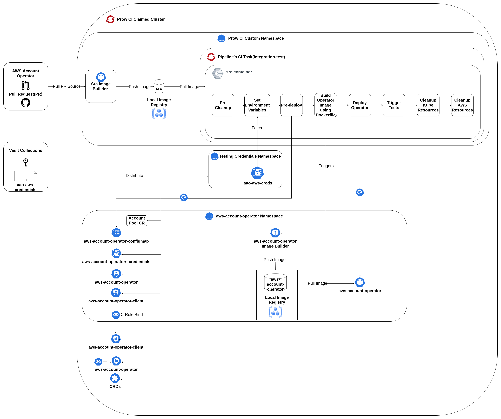

# 7.0 Prow CI Integration Test Framework

Content:

- [7.0 Prow CI Integration Test Framework](#70-prow-ci-integration-test-framework)
  - [7.1 - Quick References](#71-quick-references)
  - [7.2 - CI Operator Tooling(Prow)](#72-ci-operator-toolingprow)
  - [7.3 - CI Operator & AWS Account Operator](#73-ci-operator--aws-account-operator)
    - [7.3.1 - Steps for updating AAO Prow configuration](#731-steps-for-updating-aao-prow-configuration)
  - [7.4 - Integration test CI step configuration](#74-integration-test-prow-ci-step-configuration)
  - [7.5 - Integration Test Script](#75-integration-test-script)
    - [7.5.1 - Integration Test flow diagram](#751-integration-test-flow-diagram)
    - [7.5.2 - Integration Test flow diagram](#752-artifacts-and-logs-of-test-steps)

## 7.1 Quick References
* [AAO Openshift CI config](https://github.com/openshift/release/blob/master/ci-operator/config/openshift/aws-account-operator/openshift-aws-account-operator-master.yaml) - used to generate Prow CI job definitions which run on infrastructure at https://prow.ci.openshift.org/ 
* [AAO Openshift CI job definitions](https://github.com/openshift/release/tree/master/ci-operator/jobs/openshift/aws-account-operator) (generated source)
* [AAO Prow CI jobs service](https://prow.ci.openshift.org/?job=*aws-account-operator*) 
* [Prow CI secret collections](https://selfservice.vault.ci.openshift.org/secretcollection?ui=true) - collection name: aao-aws-credentials (you need to log in and ask an existing collection member to add you to the aao-aws-credentials member list)
* [AAO secret vault](https://vault.ci.openshift.org/ui/vault/secrets/kv/show/selfservice/aao-aws-credentials/index)  - access managed by Prow CI secret collection membership (see previous bullet)
* [AAO integration-test-bootstrap.sh](/hack/scripts/integration-test-bootstrap.sh) - used in tandem with the [AAO Makefile](/Makefile) to bootstrap running integration tests (build, deploy, validate, test, cleanup, etc.).
* [AAO cleanup-aws-resources.sh](/hack/scripts/cleanup-aws-resources.sh) - used as a safety measure to try to prevent cost incurring AWS resource leaks (e.g. leaving an ec2 instance running).

## 7.2 CI Operator Tooling(Prow)

The [CI Operator](https://docs.ci.openshift.org/docs/architecture/ci-operator/) or Openshift CI is a set of tools designed for use with Github repositories present in the [Openshift Organization](https://github.com/openshift). It helps perform end-to-end test suites using pools of Openshift clusters so developers can focus on the content of their tests instead of the complexities of infrastructure maintenance. Openshift CI uses pipelines, builds and image streams extensively to achieve e2e test step runs. In particular, CI Operator allows repositories to easily define action that trigger on pull request submission to provide feedback to developers before merging such as code coverage, running unit tests, etc.

Note: the CI Operator pipelines and infrastructure should not be confused with either [app-interface](https://gitlab.cee.redhat.com/service/app-interface) or [osde2e](https://github.com/openshift/osde2e).

## 7.3 CI Operator & AWS Account Operator

AWS Account Operator (AAO) uses Openshift CI to define and run Prow jobs when PRs are submitted or altered. [AAO's Prow configuration](https://github.com/openshift/release/blob/master/ci-operator/config/openshift/aws-account-operator/openshift-aws-account-operator-master.yaml) is an abstraction used to generate [the actual job definitions](https://github.com/openshift/release/tree/master/ci-operator/config/openshift/aws-account-operator) using `make update` from the [openshift release repo](https://github.com/openshift/release).

### 7.3.1 Steps for updating AAO Prow configuration

For complete details on working with the Openshift release repository, refer to [their documentation](https://docs.ci.openshift.org/docs/how-tos/contributing-openshift-release/). The following steps will get you started for AAO's CI Operator use:

  - Update [AAO Prow source file](https://github.com/openshift/release/blob/master/ci-operator/config/openshift/aws-account-operator/openshift-aws-account-operator-master.yaml).
  - Run `make-update` (ensure docker service is running). This will re-generate [AAO's Prow job definitions](https://github.com/openshift/release/tree/master/ci-operator/config/openshift/aws-account-operator)
  - Commit all changes - both source file(s) and generated file(s).
  - Submit a PR to [Openshift release repository](https://github.com/openshift/release).

A rehearsal step will run against the AAO master branch as part of a presubmit check using the updated prow configuration (meaning all tests will be run just like they would if you submit a PR to the AAO repo).

## 7.4 Integration test prow CI step configuration
  - Configured a new presubmit CI step named `integration-test` [here](https://github.com/openshift/release/blob/master/ci-operator/config/openshift/aws-account-operator/openshift-aws-account-operator-master.yaml)
  - [*Temporary*] - Configured it to be optional, such that it doesn't block the merge if this new step fails. [Reference](https://docs.ci.openshift.org/docs/architecture/ci-operator/#pre-submit-tests)
  - Added a cluster claim for using a clean openshift cluster everytime a integration test step is performed, labels are used to claim cluster from desired cluster pool. [Reference](https://docs.ci.openshift.org/docs/how-tos/cluster-claim/#use-the-cluster-pool-from-a-ci-job)
  - Environment variables are required for setting up secrets & configmaps for operator deployments and credentials file for awscli, for this we use vault collection named `aao-aws-credentials` configured [here](https://vault.ci.openshift.org/ui/vault/secrets/kv/list/selfservice/aao-aws-credentials/) with collection configuration present [here](https://selfservice.vault.ci.openshift.org/secretcollection?ui=true). For managing credentials members need to be added/configured to above collection. [Reference](https://docs.ci.openshift.org/docs/how-tos/adding-a-new-secret-to-ci/)
  - Secrets are used in the CI step by defining `mount_path`,`secret name`  and `namespace` under `credentials` label. [Reference](https://docs.ci.openshift.org/docs/architecture/step-registry/#injecting-custom-credentials)
  - Add `max_concurrency: 1`, [here](https://github.com/openshift/release/blob/master/ci-operator/jobs/openshift/aws-account-operator/openshift-aws-account-operator-master-presubmits.yaml). It is needed to block concurrent runs of same CI step in different PRs/Pipeline runs.
  Integration Step uses awscli credentials which are meant to be used one at a time for similar test cases, so to avoid concurrency we use `max_concurrency`
  - [*Temporary*] `run-int-test`- A check on PR title is configured [here](https://github.com/openshift/release/blob/master/ci-operator/config/openshift/aws-account-operator/openshift-aws-account-operator-master.yaml) which only allows PR with title `run-int-test` to execute the CI step integration-test.
  - Finally, via commands label we trigger the makefile target named `prow-ci-entrypoint` present in AAO repository [here](/Makefile)

## 7.5 Integration Test Script
  - Bash script present [here](/hack/scripts/integration-test-bootstrap.sh) acts as an entrypoint to trigger integration-test for prow, staging and local crc cluster.
  - The integration-test script has 3 flows, defined as PROFILES:-
    - **local** - Use operator-sdk to build and run the operator locally. '.envrc' configures secrets and basic configuration.
    - **prow** - Used by prow CI automation. Operator image is built on the cluster using a BuildConfig then deployed. Configuration key/values are expected to be available at /tmp/secret/aao-aws-creds/ (e.g. /tmp/secret/aao-aws-creds/OPERATOR_ACCESS_KEY_ID). 
    - **staging** - Run tests against a stage OSD cluster. Operator image is built on the cluster using a BuildConfig then deployed. '.envrc' configures secrets and basic configuration.
  - The integration test script is triggered by Makefile targets named `[PROFILE]-ci-entrypoint`, where PROFILE represents the desired CI flow profile.
  - Here we aim to discuss sequential **prow profile** flow:-
    1. **parseArgs** - Determines following variables using arguments passed during script trigger:-
        - **PROFILE** - One of: ['local', 'prow', 'stage']. Determines how we build, deploy and run tests.
        - **NAMESPACE** - Sets the kube namespace used for the manifests and yaml deployment.
        - **SKIP_CLEANUP** - A boolean flag, if set skips the operator manifests cleanup.
    2. **cleanup** - Cleanups are needed as we might end up using a cluster already containing an existing aws-account-operator namespace and other manifests, also some cleanup are required when ran locally. Cleanups run at start and end of the job. There are mandatory & optional Cleanups. Optional cleanup is performed only when SKIP_CLEANUP is not set.
    Here are the mandatory cleanups that are always performed:-
        - Dockerfile soft link (created via script)
        - Operator Deployment
        - Kustomization yaml files (created via script)
        - Local log file (created only for local flow)
        - Deletion of staging-cluster-user from the cluster role named cluster-admin (Added via script, only for staging flow)
    Optional Cleanups:-
        -  aws-account-operator project/namespace deletion, namespace may contain below manifests:-
            - RBACs
            - config maps
            - secrets
    3. **sourceFromMountedKvStoreConfig** - Environment variables are extracted from the secret mount discussed above. This secret mount files contains all the secrets defined in the vault collection. This function performs the same by extracting every environment variable from the mounted kv store.
    Local and stage flow uses .envrc file to get these variables using **sourceEnvrcConfig**
    4. **preDeploy** - This step deploys manifests present in [deploy directory](/deploy). These manifests are:-
        - CRDs
        - Secret
        - Config Map
        - RBACs
    5. **buildOperatorImage** - This step creates aws-account-operator imagestream using multiple steps:-
        - create a Dockerfile softlink at root linking to [Dockerfile](/build/Dockerfile).
        - Create a new buildconfig, passing args `FIPS_ENABLED=false`
        - Start a build using above config and passing the source directory as binary input to build config, imagestream is created in namespace aws-account-operator.
        - Set the image-lookup for the imagestream to true, such that the image can be fetched by the imagestream name not the image's registry link.
        - Verify build completion by checking if the `status.phase` of the build pod is `Complete`.
    6. **deployOperator** - This step uses above created imagestream to be deployed as a pod using the deployment present [here](/deploy//operator.yaml). This yaml is used as a template and updated using `oc -k`(kustomize) with below changes:-
        - image: aws-account-operator:latest
        - add env variable `FORCE_DEV_MODE: cluster`
    7. **installProwCIDependencies** - Since the existing tests are written in bash script, they use awscli & jq libraries which were need to be present in the container pod. So it install dependencies:-
        - jq - dependency to read fields in a json object returned by `oc`
        - awscli- test cases need to run aws commands using aws credentials, to achieve that awscli and credentials files are setup as part of this step.
    8. Trigger existing integration tests using the Makefile target named **ci-int-tests**.
    9. **AWS Resources Cleanup** - [Cleanup Script](/hack/scripts/cleanup-aws-resources.sh) is used to monitor osd-staging-1 and osd-staging-2 aws accounts and delete the EC2 instances and VPCs for that were created during the integration test run. 

    ### 7.5.1 Integration Test flow diagram
    

    ### 7.5.2 Artifacts and logs of test steps
    - For all the job history, go [here](https://prow.ci.openshift.org/job-history/gs/origin-ci-test/pr-logs/directory/pull-ci-openshift-aws-account-operator-master-integration-test)
    - Select a revision's build triggered by the PR for which you want logs.
    - Click artifacts and for logs follow path `artifacts -> integration-test -> test -> build-log.txt`, for eg.:- [here](https://gcsweb-ci.apps.ci.l2s4.p1.openshiftapps.com/gcs/origin-ci-test/pr-logs/pull/openshift_aws-account-operator/709/pull-ci-openshift-aws-account-operator-master-integration-test/1554383241438302208/artifacts/integration-test/test/build-log.txt)
